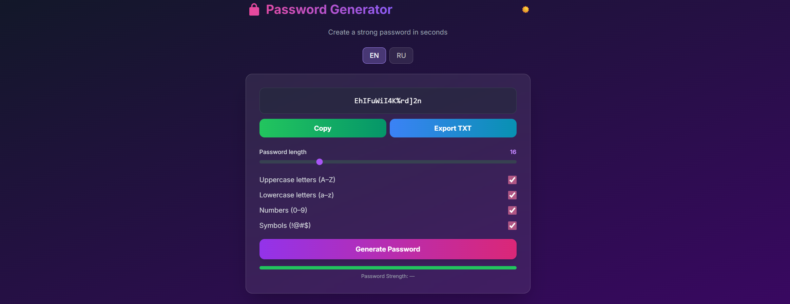

---

# Password Generator — Secure, Fast, Free

**Генератор сложных паролей** с кастомизацией, копированием в один клик, экспортом в TXT и переключением языков (RU/EN).  
Тёмная/светлая тема, адаптивный дизайн, работает **без интернета** на **GitHub Pages**.

[Live Demo](https://va-proger.github.io/vp-password-generator) · [Report Bug](https://github.com/va-proger/vp-password-generator/issues) · [Request Feature](https://github.com/va-proger/vp-password-generator/issues)

---

## Preview


> *Тёмная тема (по умолчанию)*

---

## Features

| Функция | Описание |
|--------|--------|
| **Кастомизация** | Длина (6–50), заглавные, строчные, цифры, символы |
| **Копирование** | Один клик → в буфер обмена |
| **Экспорт TXT** | Скачать пароль с метаданными |
| **RU / EN** | Полная локализация |
| **Темная / Светлая тема** | Сохранение в `localStorage` |
| **Оценка силы** | Визуальный индикатор: слабый / средний / сильный |
| **PWA-ready** | Можно установить на телефон/ПК |
| **100% клиентский** | Никаких серверов, API, бэкенда |

---

## Quick Start (GitHub Pages)

```bash
git clone https://github.com/yourusername/password-generator.git
cd password-generator
```

1. Замени `yourusername` в `index.html` на свой GitHub-ник
2. Загрузи всё в репозиторий
3. Включи **GitHub Pages** → `main` ветка → `/root`

Готово! → `https://yourusername.github.io/password-generator`

---

## Structure

```
password-generator/
├── index.html          # Главная страница
├── assets/
│   ├── style.css       # Дополнительные стили (опционально)
│   └── reset.css       # Сброс стилей
├── screenshot-dark.png # Скриншот (для README)
├── screenshot-light.png# Скриншот светлой темы
└── README.md
```

---

## Customization

Хочешь свой стиль? Легко:

```html
<!-- В index.html, замени градиент -->
<body class="bg-gradient-to-br from-indigo-900 via-purple-900 to-pink-900 ...">
```

Или добавь свои шрифты в `assets/fonts/` и подключи локально.

---

## Tech Stack

- **HTML5** + **Vanilla JS**
- **Tailwind CSS** (CDN)
- **Inter** — современный шрифт
- **Lottie** (опционально, можно добавить)
- **No build tools** — просто открой в браузере

---

## Local Development

```bash
# Открой index.html в браузере
open index.html
```

Или запусти локальный сервер:

```bash
npx serve
```

---

## Contributing

1. Форкни репозиторий
2. Создай ветку: `git checkout -b feature/awesome`
3. Сделай коммит: `git commit -m 'Add awesome feature'`
4. Запушь: `git push origin feature/awesome`
5. Открой Pull Request

---

## Author

**Андрей Викулов** — Senior Web Developer  
Bitrix | Laravel | Django | React | Tailwind

- **Website**: [viku-lov.ru](https://viku-lov.ru) (в разработке)
- **Портфолио**: [vproger.ru](https://vproger.ru)
- **VK**: [vk.com/vproger_club](https://vk.com/vproger_club)
- **Email**: [vproger@vk.com](mailto:vproger@vk.com)

---

## License

[MIT License](LICENSE) — свободно используй, модифицируй, распространяй.

---

## Star History

[](https://star-history.com/#va-proger/vp-password-generator)

---

> **Сделано с** Tailwind CSS **и** JavaScript **на GitHub Pages**
